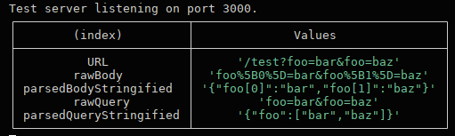

# Superagent object serialisation inconsistency

For the following superagent issue: https://github.com/ladjs/superagent/issues/1798

## Steps to reproduce

1. Fork and clone this repo.
1. `cd` into the cloned directory and run `npm i`.
1. Run `npm start` and observe the logged table.

The above image shows the actual output. Note how the same object passed as the request body and as a query param gets stringified in two different ways.
Whichever behaviour is intended, these should ideally match. The current documentation indicates that the behaviour with queries is intended.

## Steps to demonstrate fix

1. Inside `node_modules/superagent/lib/node/index.js`, change the value of the property on line 110 from `qs.stringify` to `(obj) => qs.stringify(obj, { indices: false })`.
1. `nodemon` should kick in and auto-restart the server, in which the logged table should now display unified behaviour between the request body and query serialisation.

